<div align="center">

# 🌐 Translation Management System

**A full-stack web application that streamlines every aspect of a professional translation business — from project intake to invoicing.**

[](https://github.com/sdrahnea/translation-management-system)
[](CHANGELOG.md)
[](https://www.java.com)
[](https://spring.io)
[](https://hibernate.org)
[](https://www.primefaces.org)
[](LICENSE.md)
[](CONTRIBUTING.md)

</div>

---

## 📖 Overview

**Translation Management System (TMS)** gives translation agencies and freelance teams a single platform to manage the complete project lifecycle: from receiving a client order and assigning translators, all the way through delivery, invoicing, and financial reporting.

> **Who is this for?**  
> Translation agency managers, project coordinators, and business owners who need structured control over their workflows, team, and financials — without relying on spreadsheets.

### ✨ Key Highlights

| Area | What you can do |
|---|---|
| 📁 **Projects** | Create, update, archive, and track full project lifecycle with sub-project support |
| 👥 **Translators** | Manage translator profiles, assignments, payments, and applicants |
| 🏢 **Clients** | Maintain a full client directory with contact and billing info |
| 📦 **Archive** | Safely archive completed projects and restore them on demand |
| 📊 **Statistics** | Financial reporting across all projects and time periods |
| 🧾 **Invoices** | Track all invoiced projects in one dedicated view |
| 📧 **Email Audit** | Review a log of all failed notification emails |
| ⚙️ **Settings** | Admin-controlled system variables: countries, currencies, translation areas, and more |
| 🗄️ **Data Import** | Bulk-import clients or translators from Excel / CSV files |
| 🔐 **Users & Roles** | Four access levels: `admin`, `manager`, `translator`, `client` |

---

## 🏗️ Architecture

```
┌─────────────────────────────────────────────────────────┐
│                     Browser / Client                     │
│              (JSF / PrimeFaces / XHTML views)            │
└───────────────────────────┬─────────────────────────────┘
                            │ HTTP
┌───────────────────────────▼─────────────────────────────┐
│                  Apache Tomcat (WAR)                     │
│  ┌─────────────────────────────────────────────────┐    │
│  │              Spring MVC / JSF Layer              │    │
│  │   Managed Beans  │  Spring Security (Auth/Authz) │    │
│  └──────────────────┬──────────────────────────────┘    │
│  ┌──────────────────▼──────────────────────────────┐    │
│  │              Service Layer (Spring)              │    │
│  │       Business Logic  │  Email Notifications    │    │
│  └──────────────────┬──────────────────────────────┘    │
│  ┌──────────────────▼──────────────────────────────┐    │
│  │           Data Access Layer (Hibernate)          │    │
│  │    JPA Entities  │  DAO Impl  │  EHCache L2      │    │
│  └──────────────────┬──────────────────────────────┘    │
└─────────────────────┼───────────────────────────────────┘
                      │ JDBC
          ┌───────────▼───────────┐
          │   Database            │
          │   H2 · MySQL · Postgres│
          └───────────────────────┘
```

---

## 📸 Screenshots

<table>
  <tr>
    <td>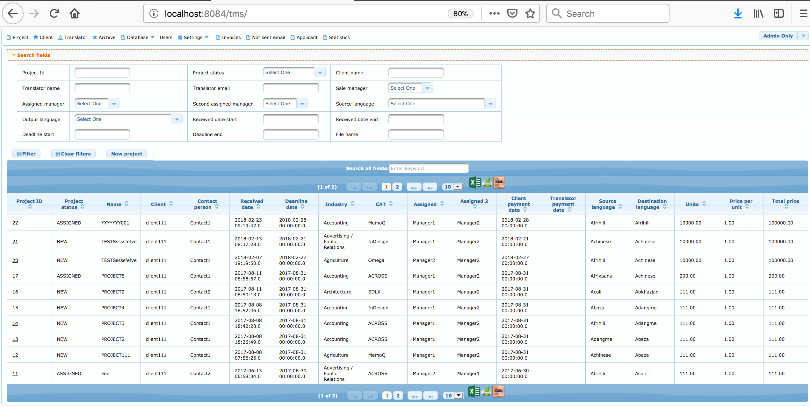<br/><sub>Project List</sub></td>
    <td>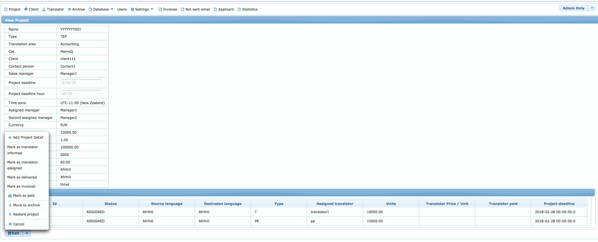<br/><sub>Project Page</sub></td>
    <td>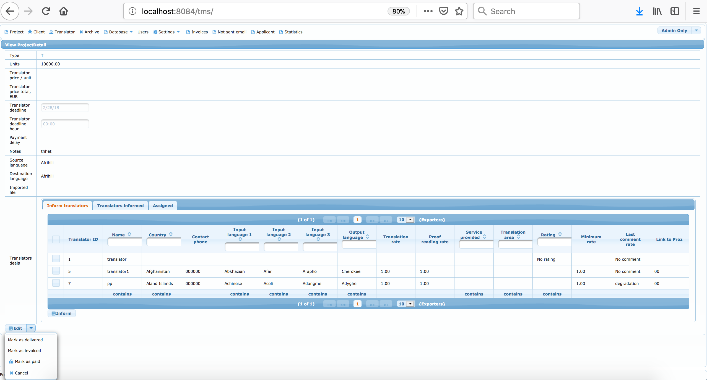<br/><sub>Project Details</sub></td>
  </tr>
  <tr>
    <td>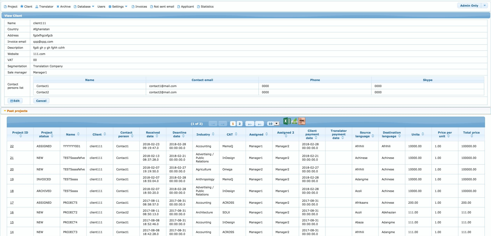<br/><sub>Client Page</sub></td>
    <td>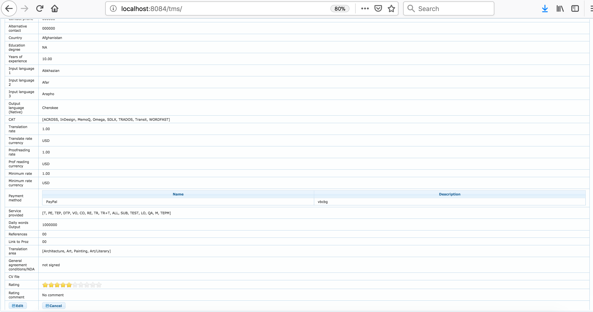<br/><sub>Translator Page</sub></td>
    <td>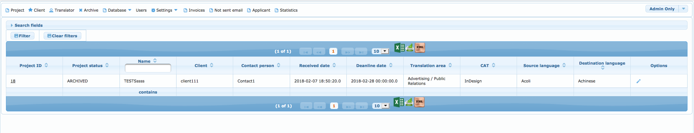<br/><sub>Archive</sub></td>
  </tr>
  <tr>
    <td>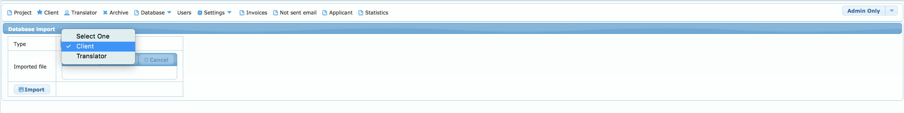<br/><sub>Data Import</sub></td>
    <td>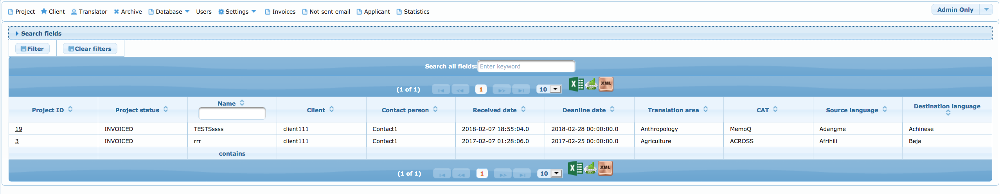<br/><sub>Invoices</sub></td>
    <td>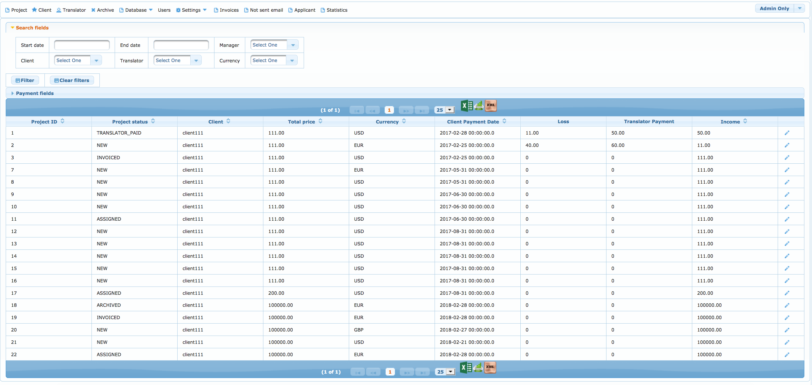<br/><sub>Statistics</sub></td>
  </tr>
  <tr>
    <td>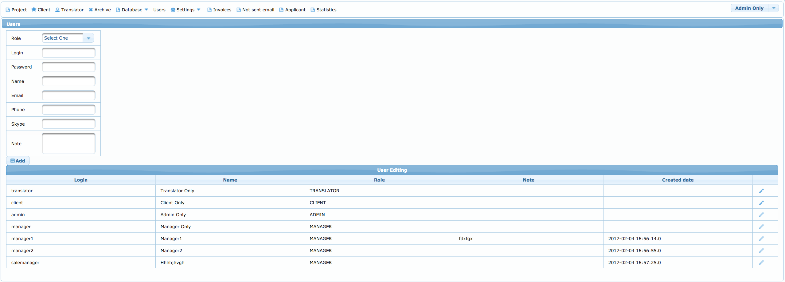<br/><sub>Users</sub></td>
    <td>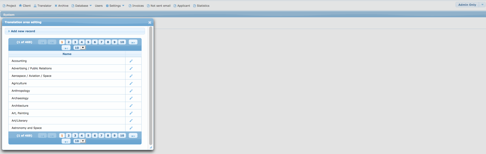<br/><sub>Settings</sub></td>
    <td>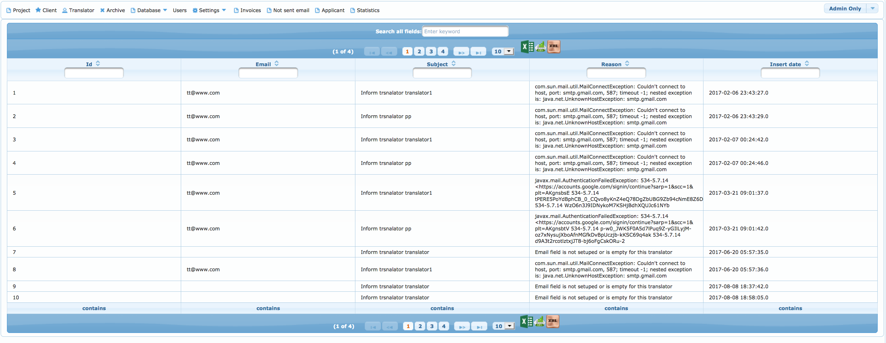<br/><sub>Email Audit</sub></td>
  </tr>
</table>

---

## 📋 Table of Contents

- [Overview](#-overview)
- [Architecture](#-architecture)
- [Screenshots](#-screenshots)
- [Getting Started](#-getting-started)
  - [Prerequisites](#prerequisites)
  - [Database Setup](#database-setup)
  - [Build & Install](#build--install)
- [Deployment](#-deployment)
- [Data Import API](#-data-import-api)
- [Built With](#-built-with)
- [Contributing](#-contributing)
- [Versioning](#-versioning)
- [Authors](#-authors)
- [License](#-license)
- [Support & Donation](#-support--donation)

---

## 🚀 Getting Started

Clone the repository:

```bash
git clone https://github.com/sdrahnea/translation-management-system.git
cd translation-management-system
```

### Prerequisites

| Tool | Version |
|---|---|
| Java (JDK) | 1.8+ |
| Apache Maven | 3.x |
| Apache Tomcat | 8.5+ / 9.x |
| Database | H2 *(dev)* · MySQL 5.7+ · PostgreSQL 10+ |

---

### Database Setup

Choose one of the supported databases:

#### Option 1 — H2 (zero-config, recommended for development)

No installation required. Configure the connection URL in `application.properties`:

```properties
# In-memory (resets on restart)
spring.datasource.url=jdbc:h2:mem:tms

# File-based (persists across restarts)
spring.datasource.url=jdbc:h2:file:./data/tms
spring.datasource.username=sa
spring.datasource.password=
```

#### Option 2 — MySQL

```sql
CREATE DATABASE tms;
```

> **MySQL 8.0.4+ note:** Run the following to enable native password authentication:
> ```sql
> ALTER USER '${USER}'@'localhost' IDENTIFIED WITH mysql_native_password BY '${PASSWORD}';
> ```

#### Option 3 — PostgreSQL

```bash
# Create a superuser (if needed)
createuser -U postgres -s tms_user

# Restore from a backup (optional)
pg_restore -d tms < /path/to/backup.sql
```

---

### Build & Install

On first startup, Hibernate auto-creates all tables and seeds reference data (project statuses, translation statuses, payment methods, education degrees, etc.).

```bash
mvn clean package
```

A successful build produces:

```
[INFO] Building war: target/translation-management-system-2.1.0-SNAPSHOT.war
[INFO] BUILD SUCCESS
```

---

## 🖥️ Deployment

1. Copy the generated `.war` file into your Tomcat `webapps/` directory.
2. Start Tomcat.
3. Open your browser:

```
http://localhost:8081/mytemplate/login.xhtml
```

**Default credentials:**

| Username | Password |
|---|---|
| `admin` | `123` |

> ⚠️ Change the default password immediately after the first login in a production environment.

---

## 📤 Data Import API

TMS supports bulk import of **clients** and **translators** via Excel (`.xlsx`) or CSV files through the **Database** page (admin only).

### Upload Request

```http
POST /mytemplate/database.xhtml
Content-Type: multipart/form-data

file=@translators.xlsx
importType=TRANSLATOR
```

### Expected File Format (CSV example)

```csv
firstName,lastName,email,phone,country,translationArea,languagePair
Jane,Doe,jane.doe@example.com,+1-555-0100,US,Legal,EN-FR
John,Smith,john.smith@example.com,+44-20-7946-0958,GB,Technical,EN-DE
```

### Response (success)

```json
{
  "status": "success",
  "imported": 2,
  "skipped": 0,
  "errors": []
}
```

### Response (partial failure)

```json
{
  "status": "partial",
  "imported": 1,
  "skipped": 1,
  "errors": [
    {
      "row": 2,
      "field": "email",
      "message": "Duplicate email address: john.smith@example.com"
    }
  ]
}
```

> The same format applies for **client** imports — use `importType=CLIENT`.

---

## 🛠️ Built With

| Technology | Purpose |
|---|---|
| [Java 1.8](https://www.java.com) | Core application language |
| [Spring Framework 4.x](https://spring.io/projects/spring-framework) | Dependency injection, MVC, transactions |
| [Spring Security](https://spring.io/projects/spring-security) | Authentication & role-based access control |
| [Hibernate 5.x](https://hibernate.org) | ORM / data persistence (JPA) |
| [PrimeFaces](https://www.primefaces.org) | Rich JSF UI component library |
| [EHCache](https://www.ehcache.org) | Second-level Hibernate cache |
| [Apache Tomcat](https://tomcat.apache.org) | Java EE web container |
| [MySQL](https://www.mysql.com) | Primary production database |
| [H2](https://h2database.com) | Embedded database for development |
| [PostgreSQL](https://www.postgresql.org) | Alternative production database |
| [Maven](https://maven.apache.org) | Build & dependency management |

---

## 🤝 Contributing

Contributions, issues, and feature requests are welcome!

1. Fork the repository
2. Create a feature branch: `git checkout -b feature/my-feature`
3. Commit your changes: `git commit -m 'Add my feature'`
4. Push to the branch: `git push origin feature/my-feature`
5. Open a Pull Request

Please read [CONTRIBUTING.md](CONTRIBUTING.md) for the full code of conduct and contribution guidelines.

---

## 🔖 Versioning

This project uses [SemVer](https://semver.org/) for versioning. See [CHANGELOG.md](CHANGELOG.md) for release history.

---

## 👤 Authors

**Sergiu Drahnea** — *Initial work*  
[](https://www.linkedin.com/in/sergiu-drahnea)

---

## 📄 License

This project is licensed under the **MIT License** — see the [LICENSE.md](LICENSE.md) file for details.

---

## 💙 Support & Donation

If this project helped you, consider supporting its development:

| Method | Details |
|---|---|
| [PayPal](https://www.paypal.me/sdrahnea) | Any amount is welcome 🙏 |
| **EGLD** | `erd1t3t5m8v7862asdh48nq820shsmlmuw9jpm87qw25cvch7djpkapskgq4es` |
| **TRX / BTT** | `TRe8xSkGqpS73Nhk6bnvW34aiJoRTmZs8N` |
| **HOT / VET** | `0x1ebfc62e2510f0a0558568223d1d101d0cf074b2` |
| **TROY / PHB** | `bnb136ns6lfw4zs5hg4n85vdthaad7hq5m4gtkgf23` · Memo: `100079140` |

---

<div align="center">
  <sub>Made with ❤️ by <a href="https://www.linkedin.com/in/sergiu-drahnea">Sergiu Drahnea</a></sub>
</div>
